# MESOS

**Software Engineering Final Project (Prova Finale di Ingegneria del Software)**
Politecnico di Milano — A.Y. 2025/2026 — Prof. Alessandro Margara — Group **AM02**

A distributed, client–server software implementation of the board game **Mesos**, built in Java with an MVC architecture. The server hosts the game logic and rules; players connect with one client each, over **Socket** or **RMI**, using a **TUI** or a **GUI**.

<p align="center">
  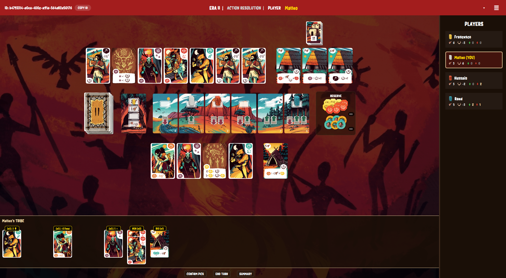
</p>

---

## The Game: Mesos

Mesos is a competitive strategy board game for **2–5 players**. Each player leads a prehistoric tribe through **three Eras**, recruiting character cards and raising buildings to accumulate **Prestige Points**; the player with the most Prestige Points at the end of the game wins.

This project implements the **Complete Rules** of the game (not the simplified set, and without the "expert variant"). The authoritative rulebooks are included in the deliverables: [`mesos-rules-it.pdf`](deliverables/rules/mesos-rules-it.pdf) and [`mesos-rules-eng.pdf`](deliverables/rules/mesos-rules-eng.pdf); in case of discrepancy the Italian version prevails. The official project requirements are in [`requirements.pdf`](deliverables/requirements/requirements.pdf).

---

## Features

| Area | Status |
|------|--------|
| **Network — Socket (TCP)** | ✅ Implemented |
| **Network — RMI** | ✅ Implemented |
| **Mixed network games** (Socket and RMI players in the same game) | ✅ Supported |
| **Interface — TUI** (text-based) | ✅ Implemented |
| **Interface — GUI** (JavaFX) | ✅ Implemented |
| **Rules** | ✅ Complete Rules |
| **MVC architecture** | ✅ |

### Advanced Features (FA)

| Advanced Feature | Chosen |
|------------------|--------|
| **Multiple simultaneous games** | ✅ Yes |
| **Persistence** (server periodically saves game state to disk and can resume after a crash) | ✅ Yes |
| **Disconnection resilience** | ✅ Yes |
| Game-ranking database (MySQL/PostgreSQL) | ❌ **Not chosen** |

**Disconnection resilience & AutoPlayer.** Disconnected players (network drop or client crash) can reconnect with the same nickname and resume play. While a player is offline the game keeps going and their turns are handled automatically by the **AutoPlayer**, so the match never stalls. If only one player remains connected, the game keeps running (the lone player plays on, with the AutoPlayer covering the absent ones) and a forfeit timer starts: if someone reconnects before it expires the timer is cancelled, otherwise when it expires the last connected player wins by forfeit. Connection health is tracked with a heartbeat (ping/pong) mechanism.

### Architectural note — nickname uniqueness (differs from the official spec)

The official requirements state that a nickname must be globally unique among all connected users. **In this implementation, nickname uniqueness is scoped to a single Lobby/Game, not globally.**

- Two players **cannot** share the same nickname **within the same lobby or game**.
- Two players **can** use the **same nickname** if they are in **different concurrent games/lobbies**.

This is a deliberate design choice that fits the *multiple simultaneous games* feature: each game is an isolated namespace, which is also what reconnection relies on (a player rejoins their own game using their nickname).

---

## Architecture

The application follows a **Model–View–Controller (MVC)** design split across a **client–server** boundary. The **server** owns the authoritative game state (the Model) and the controllers that enforce the rules; each **client** runs its own lightweight view-side model and a View that can be either **TUI** or **GUI**. Communication happens through a network layer that is transparent to the rest of the code: the same game logic runs whether a player is connected over **Socket (TCP)** or **RMI**, and the two can even coexist in the same game.

<p align="center">
  
</p>

The full-resolution diagram is in [`deliverables/class-diagrams/00_Architecture_Overview.pdf`](deliverables/class-diagrams/00_Architecture_Overview.pdf); the detailed per-layer class diagrams are in [`deliverables/class-diagrams/`](deliverables/class-diagrams/).

---

## Screenshots

Both the **GUI** and the **TUI** implement the complete game. The screenshots below follow a match from browsing the lobbies to in-game play; where the same step exists in both interfaces, they are shown side by side.

> **Note:** the screenshots are for **illustrative purposes only** and do **not** necessarily refer to the same match — they were captured across different games to show each feature.

### Lobby browser

<table>
<tr><th width="50%">GUI</th><th width="50%">TUI</th></tr>
<tr>
<td>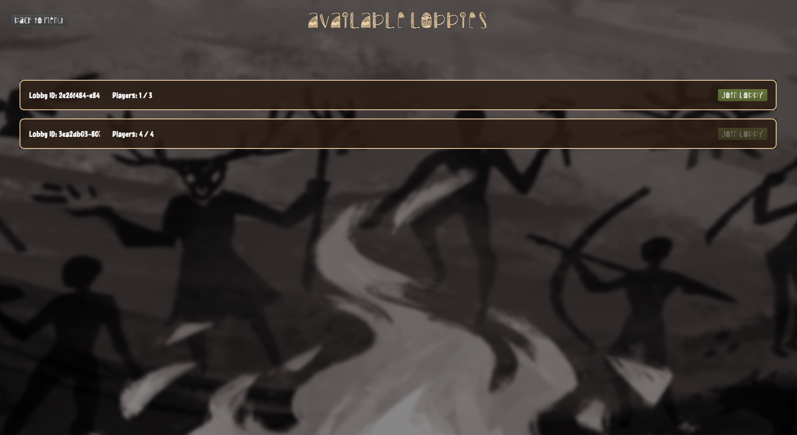</td>
<td>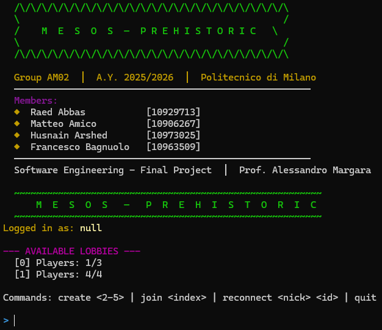</td>
</tr>
<tr><td colspan="2" align="center"><sub>Browse the available lobbies, then create a new one or join an existing one.</sub></td></tr>
</table>

### Lobby — nickname & totem selection

<table>
<tr><th width="50%">GUI</th><th width="50%">TUI</th></tr>
<tr>
<td>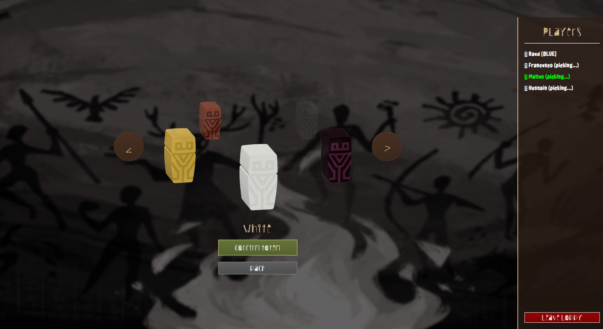</td>
<td>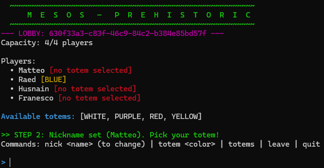</td>
</tr>
<tr><td colspan="2" align="center"><sub>Inside a lobby: set your nickname and pick a totem before the game starts.</sub></td></tr>
</table>

### In game

The full **GUI** game board is shown in the banner at the top of this README. Below, the **New Era** transition (GUI) and the complete board rendered as text by the **TUI**:

<table>
<tr>
<td width="50%">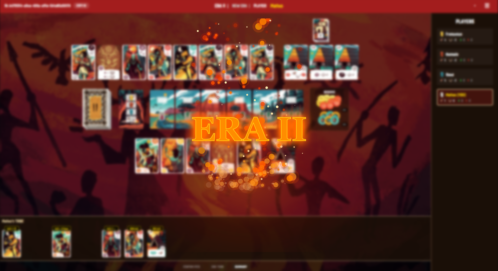</td>
<td width="50%">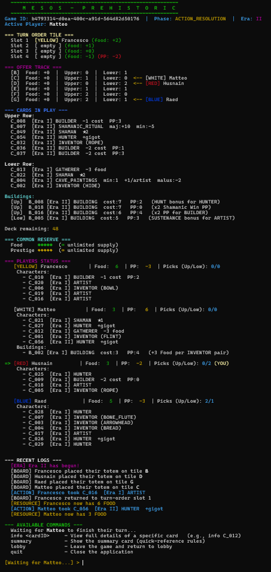</td>
</tr>
<tr>
<td align="center"><sub><b>New Era</b> (GUI) — the animated transition between the three Eras.</sub></td>
<td align="center"><sub><b>Game board</b> (TUI) — the full game state in the terminal.</sub></td>
</tr>
</table>

### Disconnection resilience & AutoPlayer in action

When a player drops, the match never stalls: the **AutoPlayer** takes over their turns, and a disconnected client automatically attempts to reconnect using its **Game ID**. Both interfaces surface these states clearly.

**Reconnection — fast-forward resync.** When a player reconnects (whether through a manual rejoin or the automatic reconnection), they are shown a *fast-forwarded replay* of everything that happened from the start of the match, until their state is fully **synchronized** with the current game. This is powered by an **event-sourcing** pattern: the game is reconstructed by replaying the granular notifications emitted since the beginning of the match.

<table>
<tr><th width="50%">GUI</th><th width="50%">TUI</th></tr>
<tr>
<td>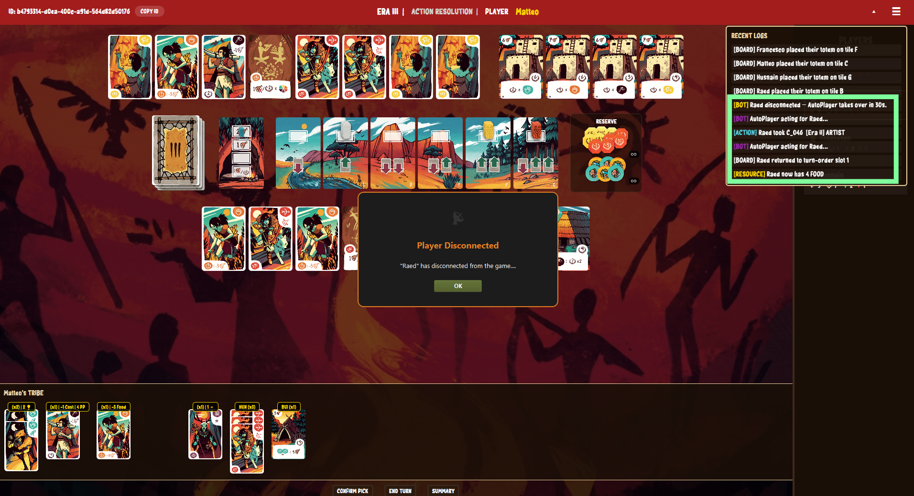</td>
<td>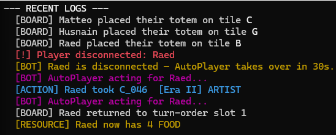</td>
</tr>
<tr><td colspan="2" align="center"><sub>A player disconnects — the <b>AutoPlayer</b> takes over their turns so the game keeps going.</sub></td></tr>
<tr>
<td>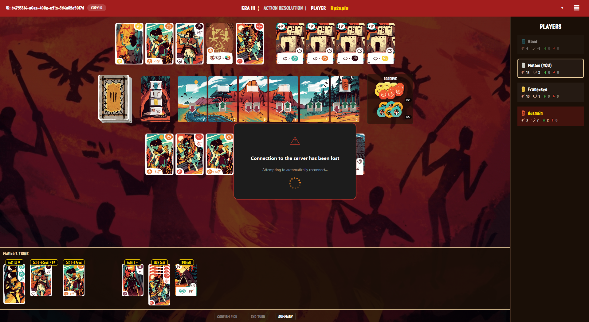</td>
<td>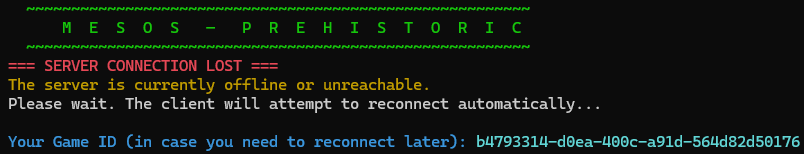</td>
</tr>
<tr><td colspan="2" align="center"><sub>The server becomes unreachable — the client reports it and <b>auto-reconnects</b> using the Game ID.</sub></td></tr>
<tr>
<td>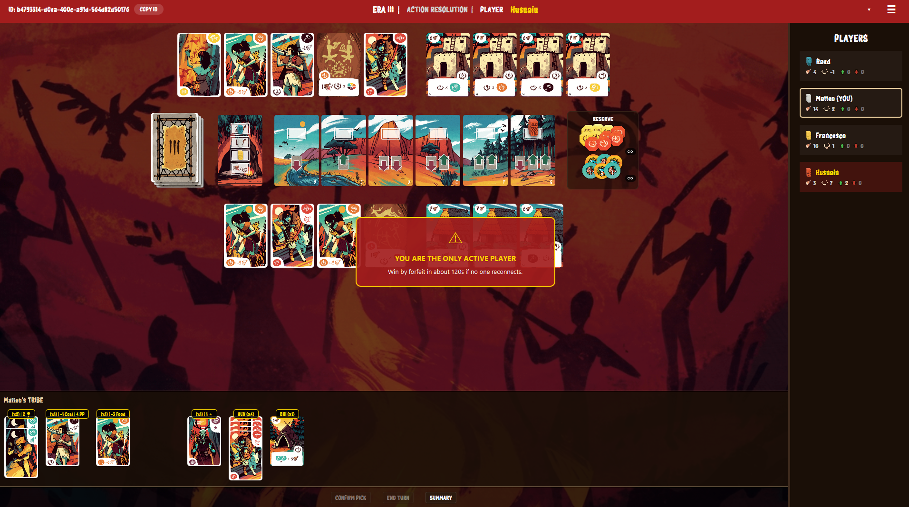</td>
<td>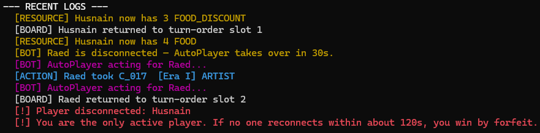</td>
</tr>
<tr><td colspan="2" align="center"><sub>Only one player left connected: a <b>forfeit timer</b> starts — <i>"in 120s, if no one reconnects, you win by forfeit…"</i>. If someone reconnects in time the timer is cancelled; otherwise the lone player wins by forfeit.</sub></td></tr>
</table>

---

## Test Coverage

Coverage was measured with **JaCoCo**. The full HTML report is at [`deliverables/coverage/index.html`](deliverables/coverage/index.html).

Testing focuses on the **Model** (the game logic), which is the core of the application. UI (GUI/TUI), networking and orchestration layers are not unit-tested by design.

| Package (Model) | Instructions | Branches |
|-----------------|:-----------:|:--------:|
| `server.model` | 93% | 73% |
| `server.model.buildingeffects` | 100% | 95% |
| `server.model.effect` | 99% | 98% |
| `server.model.card` | 98% | 85% |
| `server.model.tile` | 98% | 91% |
| `server.model.player` | 93% | 69% |
| `server.model.listeners` | 81% | 80% |
| `server.model.enumerations` | 100% | — |
| `server.model.exceptions` | 95% | — |
| `client.model` | 99% | 78% |
| `common.dto` | 100% | 75% |
| `common.enumerations` | 92% | — |

---

## API Documentation (Javadoc)

The full Javadoc generated from the source code is in [`deliverables/apidocs/`](deliverables/apidocs/index.html) — open `index.html`.

It can be regenerated from source with the Maven wrapper (no local Maven needed):

```bash
./mvnw javadoc:javadoc   # Windows: .\mvnw.cmd javadoc:javadoc
```

The docs are written to `deliverables/apidocs/` as configured by the `maven-javadoc-plugin` in the `pom.xml`.

> **Note on the peer review.** The official requirements describe documentation quality as referring to *"the English JavaDoc comments in the code, the additional documentation about the communication protocol, **and the peer review documents.**"* Unlike that spec, **this year the peer review was not required**, so no peer review documents are present in this repository.

---

## How to Run the Project

### Requirements

- **Java 25 or newer**, installed and available on the `PATH`.
- No separate JavaFX installation is required: the client jar **bundles JavaFX** for **Windows**, **Linux** and **macOS (Apple Silicon)**.

The pre-built jars and launch scripts are in **`deliverables/jar/`**:

```
deliverables/jar/
├── server.jar      ├── server.command   ├── server.bat
└── client.jar      └── client.command   └── client.bat
```

> Start the **server first**, then one **client per player** (a client can also be launched multiple times on the same machine).

### Option A — Using the provided scripts (recommended)

From `deliverables/jar/`:

**Linux / macOS** — from a terminal:
```bash
./server.command
./client.command
```
On **macOS** you can also just **double-click** `server.command` / `client.command` in Finder. *(If needed once: `chmod +x server.command client.command`.)*

**Windows** — double-click, or from a terminal:
```bat
server.bat
client.bat
```

The scripts already set UTF-8 (and switch the Windows console to code page 65001), so accented text and the TUI box-drawing graphics render correctly.

### Option B — Running manually (without scripts)

From `deliverables/jar/`:

**Linux / macOS:**
```bash
java -jar server.jar
java -jar client.jar
```

**Windows — IMPORTANT:** the Windows console defaults to a non-UTF-8 code page, which breaks accented text and the TUI graphics. **Before** launching a jar, switch the console to UTF-8 with `chcp 65001` and pass the encoding flags:
```bat
chcp 65001
java -Dfile.encoding=UTF-8 -Dstdout.encoding=UTF-8 -Dstderr.encoding=UTF-8 -jar server.jar
```
```bat
chcp 65001
java -Dfile.encoding=UTF-8 -Dstdout.encoding=UTF-8 -Dstderr.encoding=UTF-8 -jar client.jar
```

### Connection setup at startup

Default endpoints are defined in `NetworkDefaults`: **RMI port `1099`**, **Socket port `1100`**.

- **Server.** On launch it asks for:
  - the **server IP/host** for RMI — default is the machine's local IP address;
  - the **RMI port** — default `1099`;
  - the **Socket port** — default `1100`.

  Press Enter on any prompt to accept the default shown in brackets.

- **Client (TUI).** On launch it asks for:
  - the **interface**: `[1] TUI | [2] GUI`;
  - the **network protocol**: `[1] RMI | [2] Socket`;
  - the **server IP** — default `127.0.0.1`;
  - the **server port** — default depends on the chosen protocol (`1099` RMI / `1100` Socket).

- **Client (GUI).** After choosing the GUI, a **connection popup** lets the player pick the **network protocol (RMI or Socket)** and enter the **server IP** and **port** before connecting.

---

## Building from Source

The pre-built jars are already provided, so this is optional. A Maven wrapper is included (no local Maven needed):

```bash
./mvnw clean package   # Windows: mvnw.cmd clean package
```

This runs the test suite and produces `client.jar` and `server.jar` in `target/`.

---

## Team — Group AM02

Listed in alphabetical order by surname.

| Member | Codice Persona | GitHub |
|--------|:--------------:|--------|
| **Abbas Raed** | 10929713 | [@Raedabbass](https://github.com/Raedabbass) |
| **Amico Matteo** | 10906267 | [@MattAmi](https://github.com/MattAmi) |
| **Arshed Husnain** | 10973025 | [@Husnain-Arshed](https://github.com/Husnain-Arshed) |
| **Bagnuolo Francesco** | 10963509 | [@Francesco041](https://github.com/Francesco041) |

---

## Credits & Copyright

**Mesos** is a board game distributed in Italy by **Cranio Creations**. All rights to the game — including its rules, artwork, graphics and other original assets — belong to **Cranio Creations** ©.

This project is a non-commercial software implementation developed **for educational purposes only**, as part of the Software Engineering Final Project at Politecnico di Milano. It is not affiliated with, endorsed by, or sponsored by Cranio Creations.

### Fonts

The GUI bundles two third-party fonts (full notices in [`src/main/resources/fonts/`](src/main/resources/fonts/)):

| Font (file) | Designer | License | Source |
|-------------|----------|---------|--------|
| **Tribal** (`tribal.ttf`) | Des — Apostrophic Laboratories | Freeware | [fonts2u.com](https://fonts2u.com/tribal.font) |
| **c Caves** (`intro.ttf`) | Wahyu Eka Prasetya (*wep*) | Donationware — free for personal use | [dafont.com](https://www.dafont.com/c-caves.font) · [wepfont.com](https://wepfont.com) |

> **Note:** *c Caves* is **donationware** (free for personal use). It is used here only for this non-commercial, educational project; any commercial use would require the author's permission.
